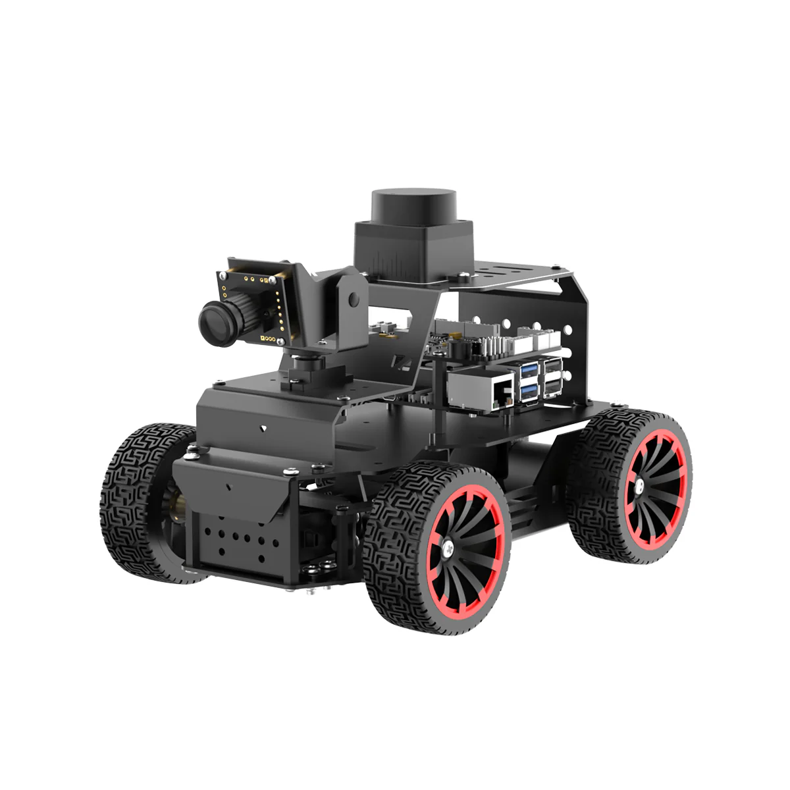

# 🚗 See:Park - 모방학습을 활용한 자율주행 발렛 파킹 로봇

ROS2 기반의 **Hiwonder MentorPi**를 활용한 자율 주차 및 주행 프로젝트입니다.  
MobileNetV3 기반의 모방 학습(Imitation Learning) 모델을 적용하여 주행 제어와 객체 인식을 동시에 수행합니다.

---

## 🛠 Hardware (H/W)

**Platform:** Hiwonder MentorPi (Ackerman Steering)  
**Device:** Raspberry Pi 5 (8GB memory)  
**System:** ROS2 Environment

  
  
<em>Hiwonder MentorPi Ackerman</em>

---

## 🧠 Software & Algorithm

### 모방 학습 (Imitation Learning)
본 프로젝트는 **모방 학습**을 통해 로봇을 제어합니다. 효율적인 연산을 위해 경량화 모델인 **MobileNetV3-Small**을 백본(Backbone)으로 사용했습니다.

### Model Architecture: Multi-Head Network
단일 모델에서 주행과 판단을 동시에 처리하기 위해 멀티 헤드(Multi-Head) 구조를 채택했습니다.

* **Backbone:** MobileNetV3-Small (Feature Extractor)
* **Head 1 (Regression):** `cmd_vel` 예측 (선형 속도 및 각속도 제어)
* **Head 2 (Classification):** 상태 분류 (표지판 인식, 주차 완료 상태 판별 등)

---

## 📺 Demo

실제 주행 및 주차 테스트 결과입니다.

### 1. 주차 (Parking)

### 2. 주행 (Driving)

### 3. 통합 시연 (Integration)

---

## 🌐 Web Interface

